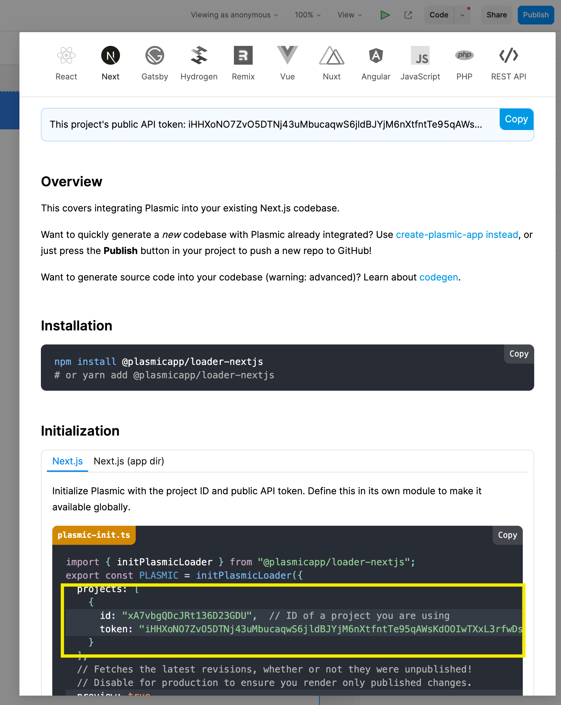
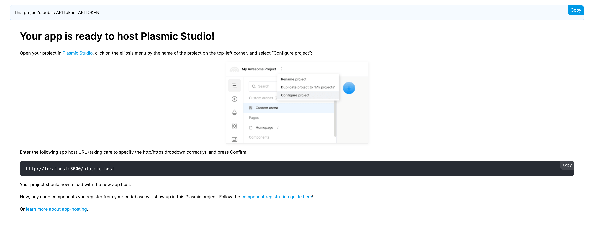
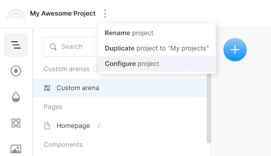
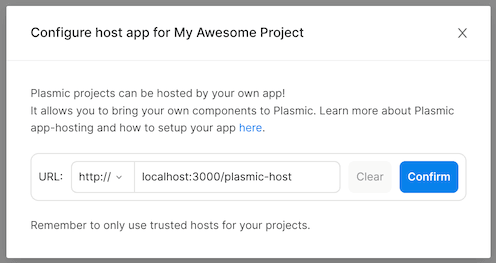

# Clickdapp
ClickDapp is powered by [**Plasmic**](https://github.com/plasmicapp/plasmic).

The clickdapp is a repository that implements Plasmic App Hosting and Near VM to provides powerful tools to make dapps with Plasmic Studio.

## Dependencies
- **PNPM**: [PNPM Installation](https://pnpm.io/installation).
- **Node.js**: [nvm (Node Version Manager)](https://github.com/nvm-sh/nvm).

## Installation

If you have any problems configuring your enviroment, or hosting this app, remember to read the [Plasmic App Hosting Documentation](https://docs.plasmic.app/learn/app-hosting/).

### Runing Local

The ClickdApp repository is based on Plasmic App Hosting ([Plasmic App Hosting Documentation](https://docs.plasmic.app/learn/app-hosting/)), which acts as the infrastructure for Plasmic Studio projects. For more information about Plasmic Studio, visit [Plasmic Studio](https://studio.plasmic.app/).

**Step 0.0 -** Before setting up the local server, it's essential to save the keys of the Plasmic project you intend to use with clickdapp.

In your Plasmic Studio, navigate to the 'Code' section.


And save the keys of your project.



**These keys will be used in the configurations of our local server.**

**Step 1.0 -** Open your terminal.

**Step 1.1 -** To run clickdapp locally on your machine, first, you need to clone the repository:

```bash
// Clone the repository

$ gh repo clone hack-a-chain-software/clickdapp
$ cd clickdapp
```

**Step 1.2 -** After that, create your .env file by filling in all the necessary values. You can make a copy of the .env.example file and add data as per your requirements:

```bash
// Copy .env.example as .env

$ cp .env.example .env
```

The project currently utilizes 4 environment configurations:

- `NEXT_PUBLIC_NETWORK_ID`: Corresponds to the network that clickdapp will use (either mainnet or testnet).
- `PLASMIC_ID`: Use the ID value of the project keys saved earlier.
- `PLASMIC_TOKEN`: Use the Token value of the project keys saved earlier.

Ensure to update your `.env` file with the correct settings.

**Step 1.3 -** After correctly configuring your `.env` file, the next step is to install the project dependencies. We use `pnpm` for this purpose.

```bash
// Install frontend dependencies via PNPM

$ pnpm install
```

**Step 1.4 -** With all dependencies installed, you're now ready to start the local server.

```bash
// Start App Hosting

$ pnpm dev
```

Once you have your host page set up, verify that it works by visiting it. If you followed the defaults, then it should be at something like http://localhost:3000/plasmic-host, depending on which port your app host is running.

You should see something like this:



**Step 2.0 -** Once your host app is properly initialized, you need to ensure that your project in [Plasmic Studio](https://studio.plasmic.app/) utilizes your local server. This integration will give you access to the functionalities of ClickdApp.

From your Plasmic project, click on the ellipsis menu by the name of the project on the top-left corner, and select “Configure project”:



Enter your app host URL (taking care to specify the http/https dropdown correctly), and press Confirm.



Your project should now reload with the new app host.

## Deploy
The simplest way to deploy Clickdapp for use in your project within Plasmic Studio is by using Vercel. Below is the link to the tutorial:

https://drive.google.com/file/d/1DyAiDI19c44fDLW46AKiHjjWZtOiiyKM/view

## Plasmic App Host
The Plasmic App Host is a hosting solution for applications built on the Plasmic platform, streamlining the deployment and management of web user interfaces. It acts as a container that encapsulates the application, handling the necessary infrastructure to keep the UI available online without the developer needing to manage servers and maintenance.

## BOS
The BOS is a development platform that provides an environment for the rapid construction and deployment of decentralized applications (dApps). It is centered around on-chain hosted Components, enabling developers to efficiently create interactive user interfaces for smart contracts. With the capability to operate across multiple blockchains, BOS supports a chain-agnostic approach, encouraging code reusability and the composition of dApps, enhancing censorship resistance and security through code transparency and auditability.

## Rendering a BOS Component on Plasmic
Code components in Plasmic allow developers to extend the functionality of the Plasmic no-code editor with custom logic and integrations. Using the functionalities of Plasmic code components, I created a custom component capable of rendering a BOS component, taking advantage of the integration with the NEAR Virtual Machine (VM).

Like this:

```javascript
import { VmComponent } from '@/components/vm/VmComponent';

const exampleMeta = {
  name: 'bos-example',
  displayName: '[BOS] Example',
  importPath: '@/components/code',
  importName: 'Example',
}

const Example = (props) => {
  return (
    <VmComponent
      src="example/path/to/bos"
      props={props}
    />
  )
}
```

## BOS Customizable
When you register a code component in Plasmic, the first parameter is the React component function or class that you wish to register for use within the Studio.

The second parameter meta is an object containing metadata about the component. Within the Metadata object, we have the Prop property through which you can specify a lot of metadata about each prop of your code component; this helps Plasmic understand what each prop expects as an argument, so that Plasmic can generate the right UI in the Studio for users to configure these props.

Like this:

```javascript
import { VmComponent } from '@/components/vm/VmComponent';

const exampleMeta = {
  name: 'bos-example',
  displayName: '[BOS] Example',
  importPath: '@/components/code',
  importName: 'Example',
  props: {
    name: {
      type: "string",
      defaultValue: "someQuestion",
      description: "The question name this radio group controls",
    },
  },
}

const Example = (props) => {
  return (
    <VmComponent
      src="example/path/to/bos"
      props={props}
    />
  )
}

PLASMIC.registerComponent(Example, exampleMeta)
```

Within the props property of the Metadata object, there is a special property type named "slot" which accepts a value of ReactNode. This functions just like the normal component slots in Plasmic, designated for props that expect React elements to be passed in. This allows for the insertion of any React component or element into the slot, providing a flexible space within the custom component for Plasmic Studio users to embed their own UI elements

Like this:

```javascript
const exampleMeta: = {
  name: 'bos-example',
  displayName: '[BOS] Example',
  importPath: '@/components/code',
  importName: 'Example',
  props: {
    input: {
      type: "slot",
      defaultValue: [
        {
          name: 'ui-input',
          type: "component",
        }
      ],
    },
};
```

When using the slot type in a component's props within the Plasmic metadata object, you receive, through the component's props, elements that are controlled by Plasmic. This means you can render these elements anywhere within your React component. Essentially, you can act as a proxy, passing these Plasmic-controlled components down to the BOS component.

We received a React Element Object from Plasmic. A React element object is a virtual representation of an element in a React application. While it may resemble a React component, it cannot be rendered directly using the JSX syntax <Element />. Instead, you should use the {element} syntax to insert it into a JSX component.

React Element Objects do not allow us to customize the properties of the component when used. For example, we cannot add different events, classes, or states to the component.

To customize properties for Plasmic components, like adding click events to buttons or listening to input events, we have introduced a callback function called renderPlasmicElement for all components loaded from the BOS in the ClickdApp.

Its purpose is straightforward: the function takes two arguments. The first argument corresponds to which element within the Props you want to utilize, and the second corresponds to the properties you wish to add to the Plasmic UI component. It returns a clone of the React element object with the added properties.

The function:

```javascript
const renderPlasmicElement = (element, values) => {
  return React.cloneElement(props[element], values)
}
```

The styling format based on the creation of clones will most likely be modified in upcoming versions of ClickdApp

This way, for the following Plasmic Code Component:

```javascript
// Meta Props
const exampleMeta: = {
  name: 'bos-example',
  displayName: '[BOS] Example',
  importPath: '@/components/code',
  importName: 'Example',
  props: {
    input: {
      type: "slot",
      defaultValue: [
        {
          name: 'ui-input',
          type: "component",
        }
      ],
    },
};

// Code component
const Example = (props) => {
  const renderPlasmicElement = (element, values) => {
    return React.cloneElement(props[element], values)
  }

  return (
    <VmComponent
      src="example/path/to/bos"
	  props={{
        renderPlasmicElement,
        plasmicRootClassName: props.className,
      }}
    />
  )
}
```

We could load a BOS component like this:

```javascript
// BOS component
const { renderPlasmicElement, plasmicRootClassName } = props;

State.init({
  value: "",
});

return (
  <div className={plasmicRootClassName}>
    {renderPlasmicElement("input", {
      type: "text",
      name: "description",
      value: state.description,
      placeholder: "Description",
      onChange: (e) => State.update({ value: e.target.value }),
    })}
  </div>
);
```

## BOS VM Context
The VM Context is a system designed for state and event management of ClickDapp. It is built on the React Context API, which enables components to share state and event handlers without the need to prop-drill or pass down information through intermediary components. 

This code establishes a "VMContext" with the ability to hold a global state and an array of event objects. Components can register new events and trigger them, as well as update the global state, by calling the provided functions. 

The system is deliberately "agnostic," meaning it doesn't prescribe specific states or behaviors but provides a flexible mechanism for components to communicate and manage shared data as they see fit.

You can check the full code of the [**VM Context here**](https://github.com/p-destri/nearcon-clickdapp/blob/main/vm-context.tsx)

We implemented it within the PlasmicRootProvider:

```javascript
return (
    <PlasmicRootProvider
    loader={PLASMIC}
    prefetchedData={plasmicData}
    prefetchedQueryData={queryCache}
    pageParams={pageMeta.params}
    pageQuery={router.query}
    >
    {
        // pageMeta.displayName contains the name of the component you fetched.
    }
        <VMContextProvider>
            <PlasmicComponent component={pageMeta.displayName} />
        </VMContextProvider>
    </PlasmicRootProvider>
)
```

And from it, we provide the global context interaction functions: *dispatchEvent*, *registerEvent*, *dispatchState*, as well as the global state.

All resources are passed via props to the BOS component:

```javascript
import React from 'react';
import { useVMContext } from '@/vm-context';
import { VmComponent } from '@/components/vm/VmComponent';

const Example = (props) => {
  const renderPlasmicElement = (element, values) => {
    return React.cloneElement(props[element], values)
  }

  const context = useVMContext()

  return (
    <VmComponent
      src="example/path/to/bos"
	  props={{
        ...context,
        renderPlasmicElement,
        plasmicRootClassName: props.className,
      }}
    />
  )
}
```

Now that you have access to the VM Context to share information between different BOS components, you can create something like this:

```javascript
const { 
    global,
    dispatchState,
    registerEvent,
    plasmicRootClassName,
    renderPlasmicElement,
} = props;

const lusdTokenAbi = fetch(
  "https://raw.githubusercontent.com/IDKNWHORU/liquity-sepolia/main/lusd-token-abi.json"
);

if (!lusdTokenAbi || !renderPlasmicElement) {
  return "loading..."
}

State.init({
  address: undefined,
  chainId: undefined,
  balance: undefined,
});

if (Ethers.provider()) {
  const signer = Ethers.provider().getSigner();

  signer.getAddress().then((address) => {
    State.update({ address });

    // Dispatch state to save in VM Context
    dispatchState({ address });

    if (state.chainId === 11155111) {
      if (state.balance === undefined) {
        Ethers.provider()
          .getBalance(address)
          .then((balance) => {
            State.update({
              balance: Big(balance).div(Big(10).pow(18)).toFixed(2),
            });

            // Dispatch state to save in VM Context
            dispatchState({
              balance: Big(balance).div(Big(10).pow(18)).toFixed(2),
            });
          });
      }
    }
  });

  Ethers.provider()
    .getNetwork()
    .then((chainIdData) => {
      if (chainIdData?.chainId) {
        State.update({ chainId: chainIdData.chainId });

        // Dispatch state to save in VM Context
        dispatchState({ chainId: chainIdData.chainId });
      }
    });
}

return (
  <div className={plasmicRootClassName}>
    {state.address &&
      renderPlasmicElement("text", {
        children: `Balance: ${state.balance} ETH`,
      })}
  </div>
);
```
